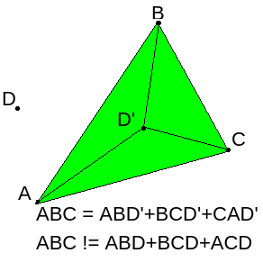

# fourDots
This program is an interview challenge.


## Task
There are coordinates of four dots (can be typed in or downloaded from a file).
You need to identify if 1 of the dots will be within the triangle made out of the other three dots.


## About program
Point position (inside or outside of the triangle) is recognized using this algorithm:

    1. Chose three points for the triangle and one required point;
    2. Creat 1 main triangle (with p1,p2,p3) and 3 triangles with the required point (p4).
    3. Calc all sides and areas of these triangles.

        ​
    4. Compare sum of areas of 3 triangles with main triangle:
     
        - if sum will be equal main     -> required point inside triangle.
        - if sum will not be equal main -> required point outside triangle.
    5. Repeat this algorithm for other combinations of points.


## Build fourDots
Clone the repository:
```
git clone https://github.com/TanchukVlad/fourDots.git
```
Run makefile:
```
make clean all:
```
Run the program:

    1. Without file with points (points.txt):
```
./fourDots
```
    2. With file points.txt (Edit file points.txt):
```
./fourDots points.txt
```